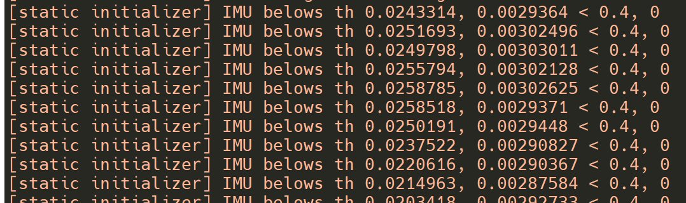
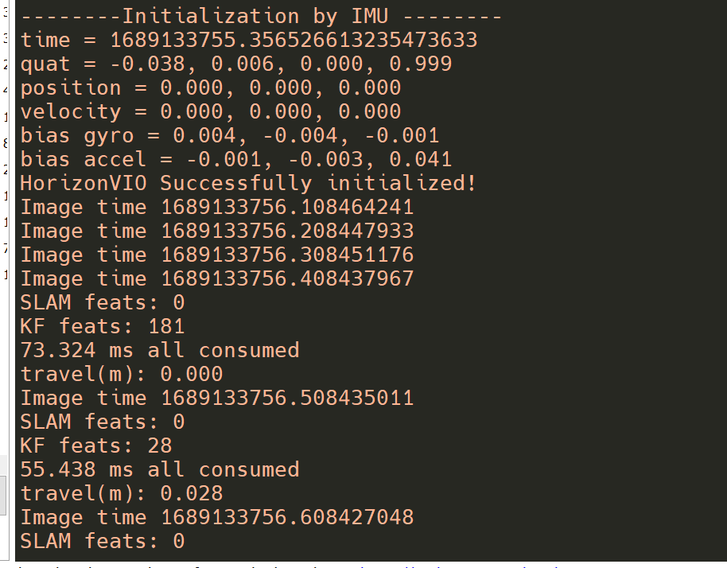
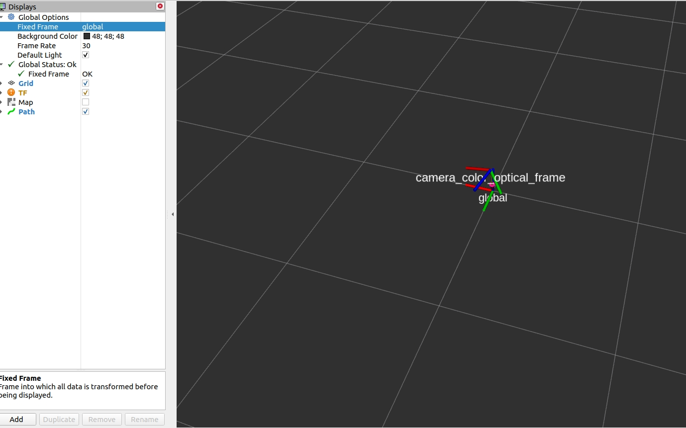
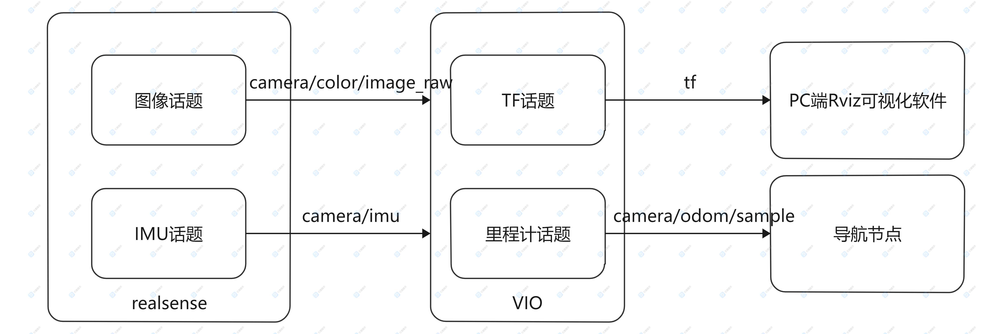

# 功能介绍

视觉惯性里程计（Visual Inertial Odometry，VIO）是融合相机与惯性测量单元（Inertial Measurement Unit，IMU）数据实现机器人定位的算法。VIO定位算法具有成本低、适用环境广等优点，在室外环境下能够有效弥补卫星定位中遮挡、多路径干扰等失效场景。优秀、鲁棒的VIO算法是实现室外高精度导航定位的关键。


# 物料清单

| 机器人名称          | 生产厂家 | 参考链接                                                     |
| :------------------ | -------- | ------------------------------------------------------------ |
| RDK X3             | 具体见参考链接 | [点击跳转](https://developer.horizon.cc/sunrise) |
| realsense          | Intel RealSense D435i |             |

# 使用方法

## 准备工作

在体验之前，需要具备以下基本条件：

- 地平线RDK已烧录好地平线提供的Ubuntu 20.04系统镜像
- 地平线RDK已安装
- realsense连接到RDK X3 USB 3.0接口

算法订阅realsense相机的图像和IMU数据作为算法的输入，经过计算得到相机的位姿信息，
并通过ROS的话题机制发布相机的位姿，位姿结果可在PC的rviz软件查看。


## 硬件连接
Realsense与RDK X3连接方式如下图：
 
 
**1.源码安装功能包**

启动机器人后，通过终端或者VNC连接机器人，复制如下命令在RDK的系统上运行，完成相关Node的编译安装。
 
**2.运行VIO功能**

(运行前请确定yaml文件中chisquare_check.txt路径正确)

启动命令，launch文件内包含启动realsense相机和vio算法模块的命令，所以只用运行一个launch文件即可：

```shell
# 配置环境
source /opt/ros/noetic/setup.bash
source /dev_ws/devel/local_setup.bash

roslaunch hobot_vio hobot_vio_infra1.launch 
```

程序运行后，会进入等待初始化状态，此时必须相机必须保持静止。
 
此时相机向前平移一段距离，此时算法检测到相机平移则会完成初始化，
此时相机持续运动，开始视觉与惯性的融合定位过程。
 

**3.查看效果**
这里采用rivz的方式观察VIO算法的效果，需要在PC上安装ROS。并且保证PC与RDK X3处于同一网段。
rviz的话题订阅如下图所示，详细的话题解释在“接口说明”一节：

 效果如下图所示


# 接口说明

 


## 输入topic
| 参数名 | 类型 | 解释  | 是否必须 | 默认值 |
| ----- | ----| -----| ------- | -----|
| image_topic  | std::string | vio算法订阅的图像数据话题名  | 是 | /camera/infra1/image_rect_raw |
| imu_topic    | std::string | vio算法订阅的IMU数据话题名  | 是 | /camera/imu  |
| sample_gap  | std::string | vio算法处理频率，1表示每帧图像都会参与轨迹计算，2表示每两帧图像计算一次，依此类推 | 是  | 2 |

## 输出topic

| topic名 | 类型 | 解释  |
| ----- | ----| -----| 
| /camera/odom/sample | nav_msgs::Odometry | vio算法输出里程计信息  |


